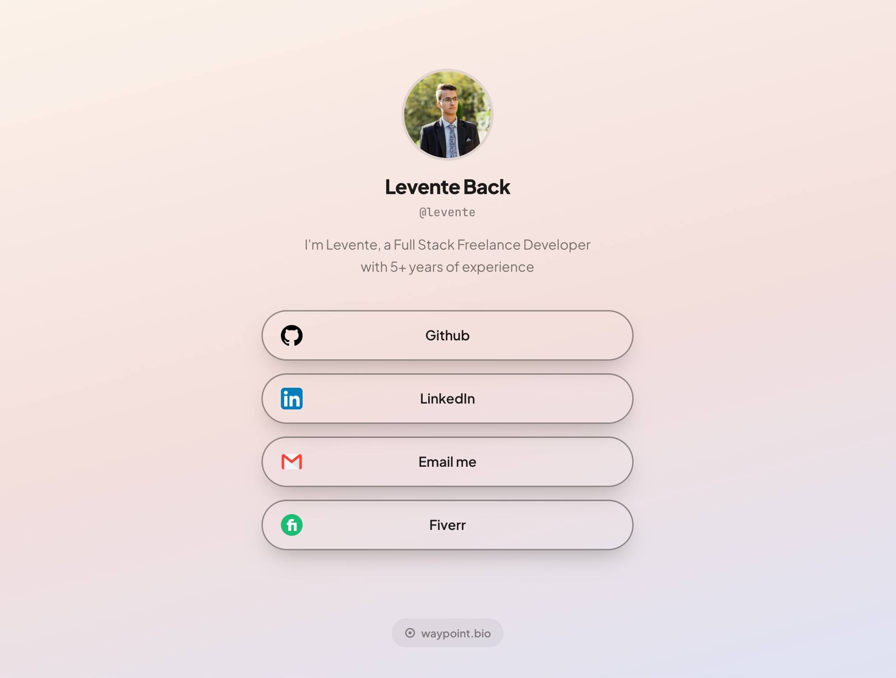
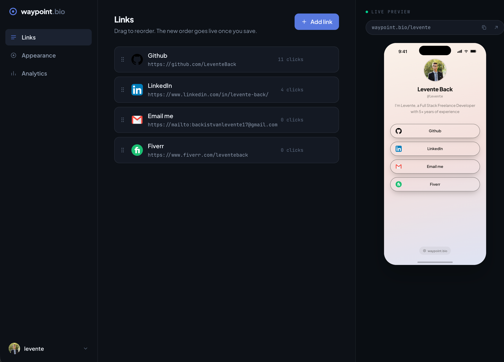
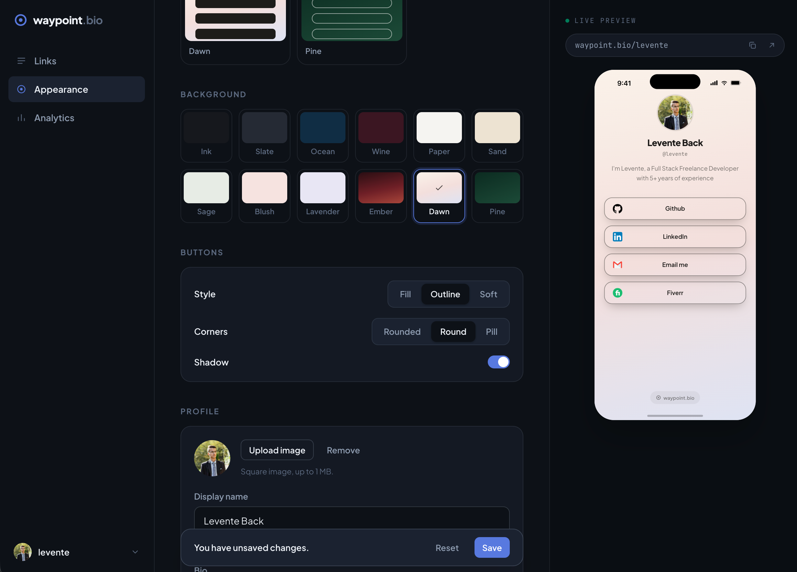
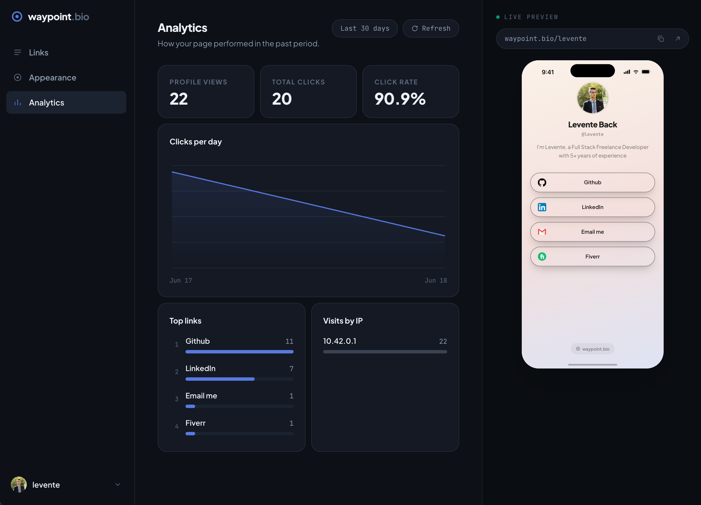
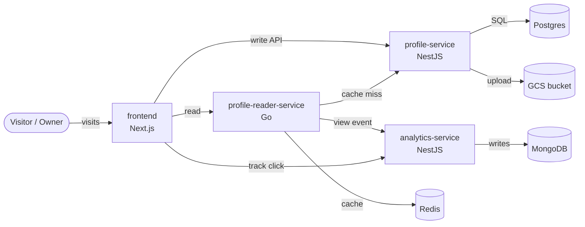

# Waypoint Bio

A link-in-bio platform: each user gets one public page (`/<username>`) that holds
their avatar, display name, bio, and a list of links, with click analytics behind
it. Built as a small set of independent services so each part owns its own data
and scales on its own.



## Screenshots

**Links editor**



**Appearance editor**



**Analytics**



## Architecture at a glance



- **frontend**: Next.js UI and SSR for the public pages.
- **profile-service**: accounts, auth (JWT), profiles, and links. Owns Postgres.
- **profile-reader-service**: public read cache for profile pages. Owns Redis.
- **analytics-service**: click and view events plus stats. Owns MongoDB.

Each service has its own database and is deployed independently. See
[docs/architecture.md](docs/architecture.md) for the full picture.

## Tech stack

| Area           | Choice                        |
| -------------- | ----------------------------- |
| Frontend       | Next.js (TypeScript)          |
| Services       | NestJS (TypeScript), Go       |
| Data           | PostgreSQL, MongoDB, Redis    |
| File storage   | Google Cloud Storage          |
| Containers     | Docker, Docker Compose        |
| Orchestration  | Kubernetes (k3s on 2 GCE VMs) |
| Infrastructure | Terraform (Google Cloud)      |
| CI/CD          | GitHub Actions                |

## Run it locally

```bash
cp .env.example .env
docker compose up --build
```

Then open http://localhost:3005. Full details in
[docs/local-development.md](docs/local-development.md).

## Documentation

| Doc                                            | Contents                                               |
| ---------------------------------------------- | ------------------------------------------------------ |
| [Architecture](docs/architecture.md)           | Services, boundaries, data ownership, request flows    |
| [Local development](docs/local-development.md) | Docker Compose, env, ports, how to test                |
| [Kubernetes](docs/kubernetes.md)               | Manifests, config & secrets, ingress, scaling, deploy  |
| [Infrastructure](docs/infrastructure.md)       | Terraform, the GCP/k3s cluster, reproduce from scratch |
| [CI/CD](docs/ci-cd.md)                         | GitHub Actions pipeline for automated deployments      |

Per-service detail (API, env, how to run) lives next to the code:
[profile-service](services/profile-service/README.md) ·
[profile-reader-service](services/profile-reader-service/README.md) ·
[analytics-service](services/analytics-service/README.md) ·
[frontend](services/frontend/README.md)
