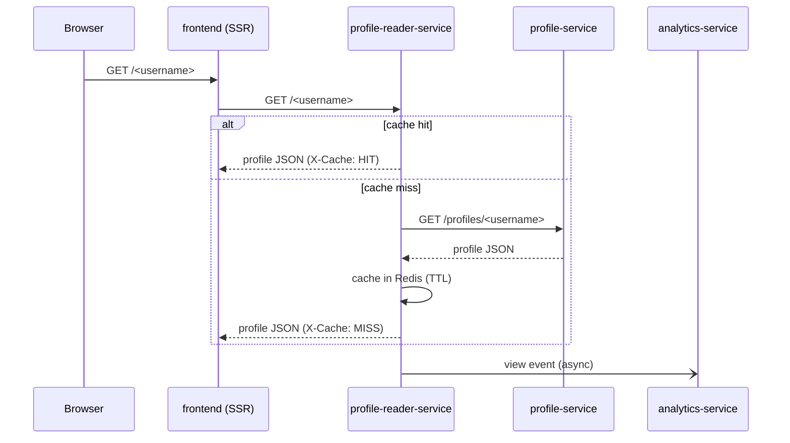

# Architecture

Four components, each with a single responsibility and its own data store. They
talk over HTTP inside the cluster, and no service shares a database.

## Services and boundaries

| Service | Stack | Owns | Responsibility |
| --- | --- | --- | --- |
| `frontend` | Next.js | none | UI, dashboard, and SSR of public pages |
| `profile-service` | NestJS | PostgreSQL | accounts, auth (JWT), profiles, links |
| `profile-reader-service` | Go | Redis | public read cache for profile pages |
| `analytics-service` | NestJS | MongoDB | click/view events and aggregated stats |

Each service is the only writer of its own database. There are no cross-service
DB connections. A service that needs another's data asks over HTTP.

## Request flows

**Public profile view** (the hot path):

**Owner edits** go straight to `profile-service`. On any write it invalidates the
reader's Redis entry so the public page reflects changes immediately.

**Image uploads** (avatar, link icons): `profile-service` streams the file to a
Google Cloud Storage bucket and stores the public URL on the profile/link.

## Why a separate reader service

Public profile pages are read far more often than they are edited. The Go
reader keeps that path cheap (Redis-first, no auth, no DB) and absorbs traffic
spikes independently of the write path. It is the one service with horizontal
autoscaling. Because it deserializes the profile into typed structs, any new
field must be added there too, not just in `profile-service`.

## Public vs internal

- **Public** (reachable from the internet via ingress): `frontend`, `profile-service`.
- **Internal only** (cluster-private, no ingress): `profile-reader-service`,
  `analytics-service`. They are reached by other services through Kubernetes DNS.

## Per-service detail

API surface, environment variables, and how to run each service standalone:

- [profile-service](../services/profile-service/README.md)
- [profile-reader-service](../services/profile-reader-service/README.md)
- [analytics-service](../services/analytics-service/README.md)
- [frontend](../services/frontend/README.md)
